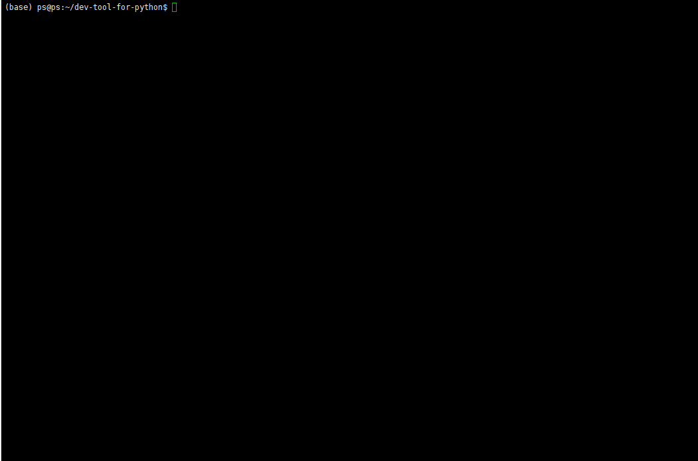

<!--
 * @lanhuage: markdown
 * @Descripttion: 
 * @version: beta
 * @Author: xiaoshuyui
 * @Date: 2021-01-06 08:24:38
 * @LastEditors: xiaoshuyui
 * @LastEditTime: 2021-01-08 11:04:10
-->
# dev-tool-for-python
 a small tool for python development

# Introduction

### Recently, I have wrote a lot of python codes but always like this.

#### I think i am a bad programmer. o(￣ヘ￣o＃)

#### I will forget where can i find the proper function or method even with a doc-string.(But i seldom write doc-string when coding alone.)

## So i want to develop a tool to record informations when coding by using python decorators.

# HOW TO USE.

