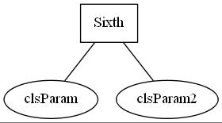
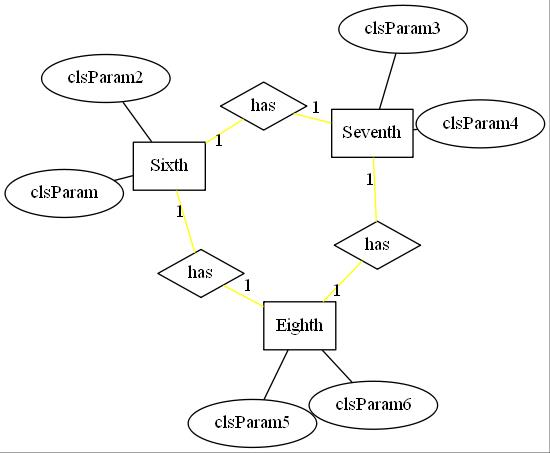
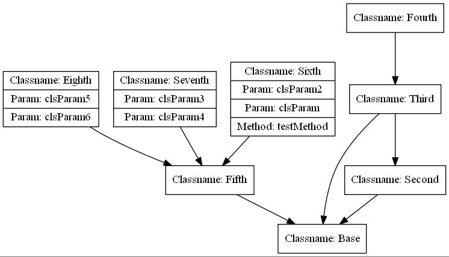

# 1. Install graphviz.exe

# 2. pip install graphviz

# Convert Entities to ER MAP/UML map

# 2021.4.10

## 1.first commit

### try this [script](../testE2U.py)

### a little complex E-R diagram

### simple UML diagram

